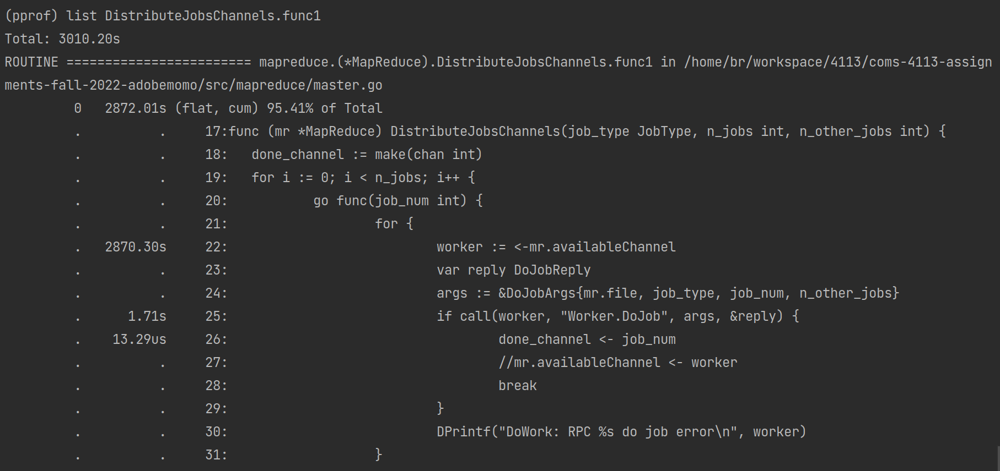

# goroutines debug tips

## label your goroutine

If you are using GoLand as the IDE for your Distributed System assignments, here is an easy way for you to debug with goroutines. By labeling, you can quickly find the goroutine you need when you pause in the debug mode.

Here I take an example code from homework 1 solution:
```golang
func (mr *MapReduce) DistributeJobsChannels(job_type JobType, n_jobs int, n_other_jobs int) {
	done_channel := make(chan int)
	for i := 0; i < n_jobs; i++ {
        go func(job_num int) {
            for {
                worker := <-mr.availableChannel
                var reply DoJobReply
                args := &DoJobArgs{mr.file, job_type, job_num, n_other_jobs}
                if call(worker, "Worker.DoJob", args, &reply) {
                    done_channel <- job_num
                    mr.availableChannel <- worker
                    break
                }
                DPrintf("DoWork: RPC %s do job error\n", worker)
            }
        }(i)
	}
	for i := 0; i < n_jobs; i++ {
		<-done_channel
	}
}
```

### label with built-in pprof
If you want to put label on a goroutine function, you can wrap the function with the pprof call.

Before: 
```go
go func(arg1, arg2 interface{}) {
    // do something
} (x, y)
```
After:

You can replace keys and values with arbitrary variables, but only in type of string.
```go
labels := pprof.Labels("key1", "value1", "key2", "value2")
pprof.Do(context.Background(), labels, func(_ context.Context) {
    go func(arg1, arg2 interface{}) {
        // do something
    } (x, y)
})
```
Then you can see the key-values appear in the goroutines list inside the Frames section under Debug window.

Let's rewrite the `func DistributeJobsChannels()` into the following code:
```go
func (mr *MapReduce) DistributeJobsChannels(job_type JobType, n_jobs int, n_other_jobs int) {
	done_channel := make(chan int)
	for i := 0; i < n_jobs; i++ {
		labels := pprof.Labels("job_type", string(job_type), "job_num", strconv.Itoa(i)) // ** add
		pprof.Do(context.Background(), labels, func(_ context.Context) { // ** add
			go func(job_num int) {
				for {
					worker := <-mr.availableChannel
					var reply DoJobReply
					args := &DoJobArgs{mr.file, job_type, job_num, n_other_jobs}
					if call(worker, "Worker.DoJob", args, &reply) {
						done_channel <- job_num
						mr.availableChannel <- worker
						break
					}
					DPrintf("DoWork: RPC %s do job error\n", worker)
				}
			}(i)
		}) // ** add
	}
	for i := 0; i < n_jobs; i++ {
		<-done_channel
	}
}
```

Here's how the Debug window will look like:


### label with 3rd party lib

By this way, you can add labels to any function without a explicit start of goroutine.

First, import the library in your code.

```go
import "github.com/dlsniper/debugger"
```
You can hover your cursor on the new imported library and execute the pop up suggestion from GoLand or call `go get -t -v github.com/dlsniper/debugger` manually in terminal.

Second, add the following code to the function you want to label with:

```go
debugger.SetLabels(func() []string {
        return []string{
            "key1", "value1",
            "key2", "value2",
        }
    })
```

Third, add `-tags debugger` to your debug configuration, following `Edit Configurations` -> `Configuration` -> `Go tool arguments`:


Then it should work as the same way when using built-in `pprof`. You can see the labels on goroutines when you pause.


## analyze blocking using pprof

`pprof` is a golang profiler tool. It can help you locate your problematic code regarding memory, heap, mutex and so on. You can use `pprof` to collect and analyze profiling data.

There're several types of data you can profile:

| type  | description  |
|---|---|
| allocs  |  A sampling of all past memory allocations |
| block  |  Stack traces that led to blocking on synchronization primitives |
| cmdline  |  The command line invocation of the current program |
| goroutine| Stack traces of all current goroutines|
|heap | A sampling of memory allocations of live objects|
|mutex |Stack traces of holders of contended mutexes |
| profile | CPU profile|
 | threadcreate|Stack traces that led to the creation of new OS threads |
 | trace| A trace of execution of the current program.|

 ### setup
 To use `pprof`, link this package into your program:

`import _ "net/http/pprof"`

If your application is not already running an http server, you need to start one. In our homework, we need to add this to test functions:

```go
go func() {
	log.Println(http.ListenAndServe("localhost:6060", nil))
}()
```

To enable mutex and blocks profiling, you'll also need to set the corresponding fraction to a positive integer:
```go
runtime.SetMutexProfileFraction(1) // enable mutex profile
	runtime.SetBlockProfileRate(1) // enable block profile
```

To make life easier, you can also use `graphviz` to visualize the call stack:
```
brew install graphviz # for macos
apt install graphviz # for ubuntu
yum install graphviz # for centos
```
Or visit https://graphviz.gitlab.io/download/ to find download for your OS.

### add buggy code
Still, I'll take hw1 solution for example.

First, I modify the function `DistributeJobsChannels`. If the master doesn't receive ok from worker, which means whether the worker is shutdown or just network problem, it will not send the worker back to available channel:
```go
// ...
if call(worker, "Worker.DoJob", args, &reply) {
	done_channel <- job_num
	// comment this out
	// mr.availableChannel <- worker
	break
}
// ...

```

Second, I make a little change to `TestManyFailures`. Instead of creating 2 new worker per second endlessly, I set a limitation on the total worker amount. Such that, if master does not put the "potentially failed" worker back, the program will be blocked.

### check what's blocking
Now run the buggy code, and the program will never end, as expected. We can use `pprof` to locate the problem. To make `pprof` work, you'll need to keep the program running.

Checkout to the terminal, and enter the directory where the test is running, then execute:

 ```
 go tool pprof http://localhost:6060/debug/pprof/block
 ```


Use `top` to see top blocking call:


`cum` is cumulative duration of current function plus calls above it. We can see that the second line has an extremly high cum. 

Use `list funcname` to see the details:




We can see that line 22 is the cause of the blocking. The master does not put worker back, so there would be no available worker, and other goroutines will be blocked forever here at line 22.

Now you know the design flaw appears in `mr.availableChannel`, and it's a good time to sit down and reconsider possible senarios regarding this channel variable.

To see a visual version of this analysis, type `web` in the interactive terminal, then a graph should be poped up in your browser:


The red blocks are calls that have problem.

### check other problem
Just the same thing. After you start running your program, type `go tool pprof http://localhost:6060/debug/pprof/whatever-you-want-to-observe`. Then `top`->`list`->`web` to locate.


## in the end...
Hope this can help you have a better view of how to debug with goroutines!